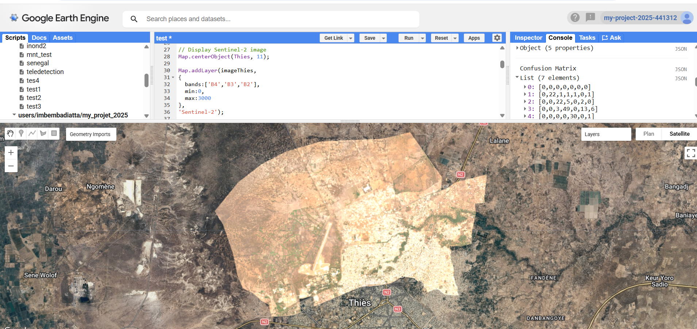
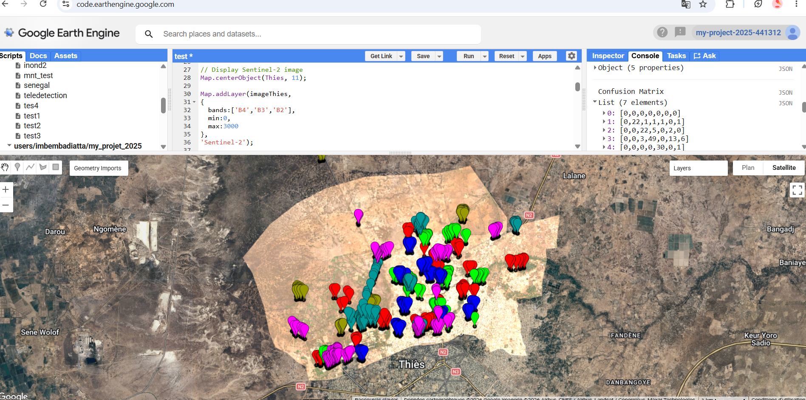
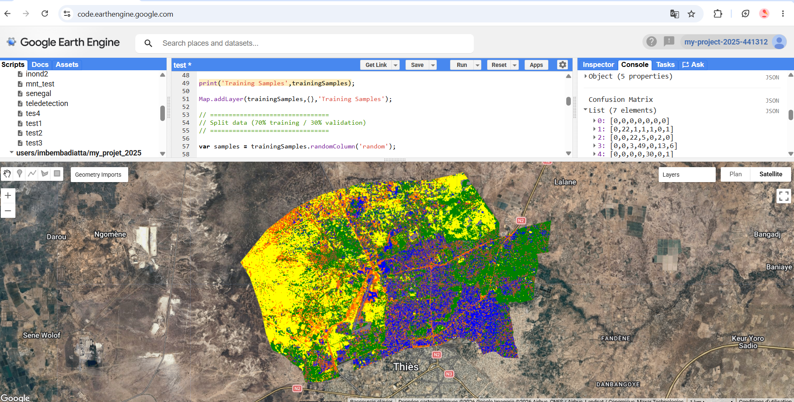

# Land Cover Classification using Sentinel-2 and Google Earth Engine

## Description

This project performs supervised land cover classification over Thiès Nord (Senegal) using Sentinel-2 imagery and the CART algorithm available in Google Earth Engine.

## Study Area

Thiès Nord, Senegal.

## Dataset

- Sentinel-2 Surface Reflectance
- Period:
  - May 2023
  - September 2023

## Spectral Bands

- B2
- B3
- B4
- B8
- B11
- B12

## Classes

| Code | Class |
|------|--------------------|
| 1 | Vegetation |
| 2 | Bare Soil |
| 3 | Buildings |
| 4 | Agricultural Soil |
| 5 | Concrete |
| 6 | Roads |

## Methodology

1. Import Sentinel-2 imagery
2. Filter by date
3. Filter by study area
4. Compute median composite
5. Create training samples
6. Train CART classifier
7. Classify image
8. Assess classification accuracy
9. Export GeoTIFF

## Results

### Sentinel-2 Composite

### Training Samples

### CART Classification

## Accuracy Assessment

The classification performance was evaluated using an independent validation dataset.

| Metric | Value |
|--------|------:|
| Overall Accuracy |  0.78 |
| Kappa Coefficient |  0.72 |

### Producer's Accuracy

| Class | Accuracy |
|--------|---------:|
| Vegetation |     0.85 |
| Bare Soil |     0.76 |
| Buildings |     0.69 |
| Agricultural Soil |     0.98 |
| Concrete |     0.70 |
| Roads |     0.80 |

### User's Accuracy

| Class | Accuracy |
|--------|---------:|
| Vegetation |     0.82 |
| Bare Soil |     0.81 |
| Buildings |     0.73 |
| Agricultural Soil |     0.98 |
| Concrete |     0.57 |
| Roads |     0.82 |

## Confusion Matrix

| Reference \\ Predicted | Veg | Bare Soil | Buildings | Agr. Soil | Concrete | Roads |
|-------------------------|----:|----------:|----------:|----------:|---------:|------:|
| Vegetation |  22 |         1 |         1 |         1 |        0 |     1 |
| Bare Soil |   0 |        22 |         5 |         0 |        2 |     0 |
| Buildings |   0 |         3 |        49 |         0 |       13 |     6 |
| Agricultural Soil |   0 |         0 |         0 |        30 |        0 |     1 |
| Concrete |   0 |         1 |         9 |         0 |       26 |     1 |
| Roads |   2 |         0 |         3 |         0 |        5 |    41 |

## Software

- Google Earth Engine
- JavaScript
- QGIS

## Author

**Ibrahima Mbemba Diatta**